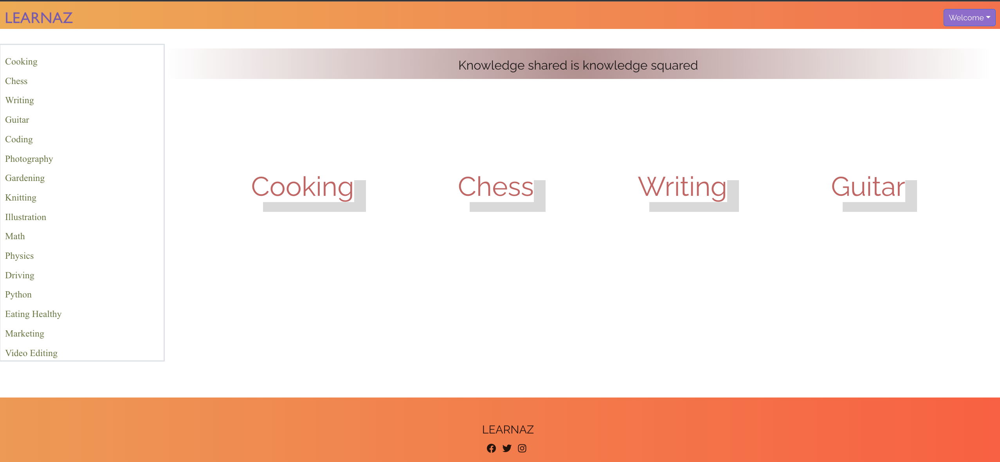
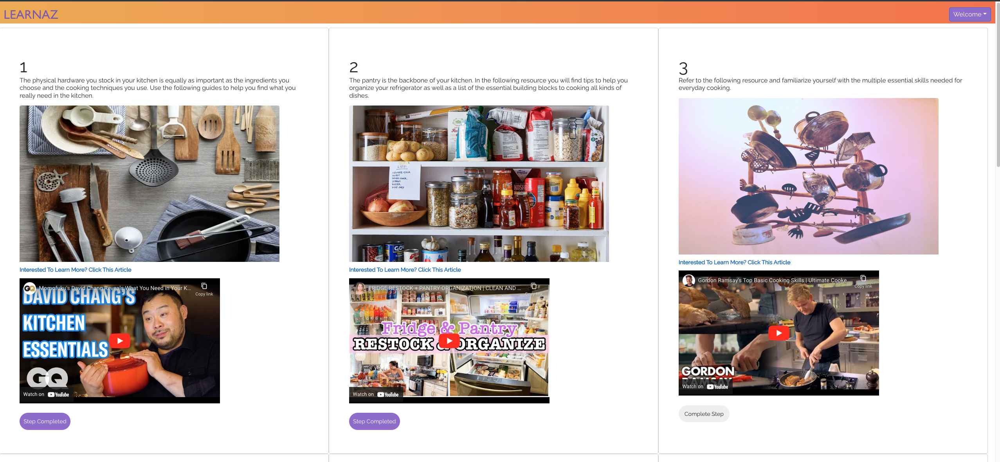
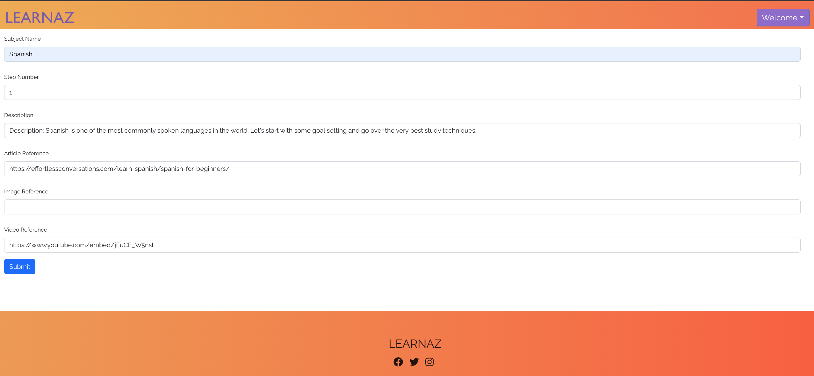
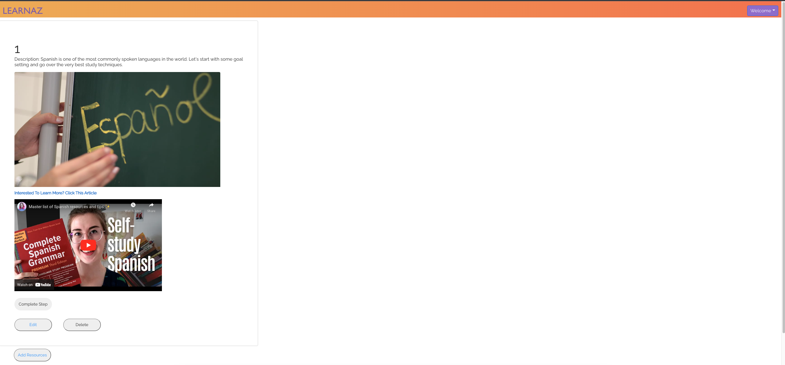

# LEARNAZ - Learn From A To Z

A web application for everyone to learn, teach and or discover new interests.
A user can navigate through dozens of subjects/courses and explore multiple resources in each subject.
An author/content-creator can add, delete and modify existing subject.
An author/content-creator can add new subject and new curriculum.

## Getting Started
1. Clone the repo
2. cd into express-back-end, run npm install and then run npm start
3. cd into react-front-end, run npm install and then run npm start
4. Go to http://localhost:3000 in your browser
