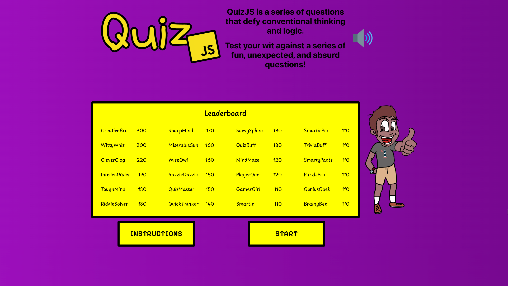
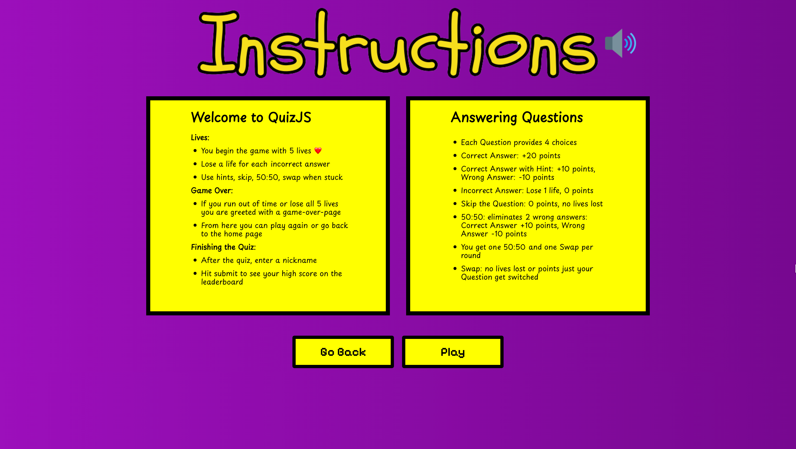
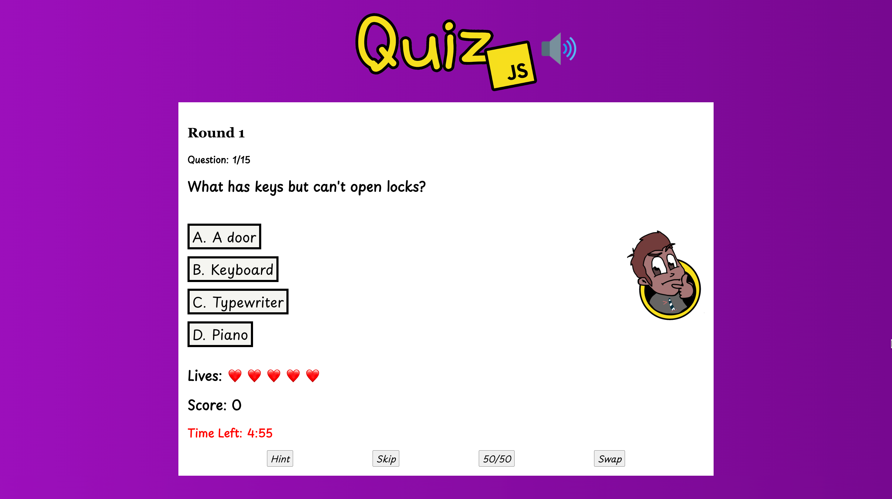
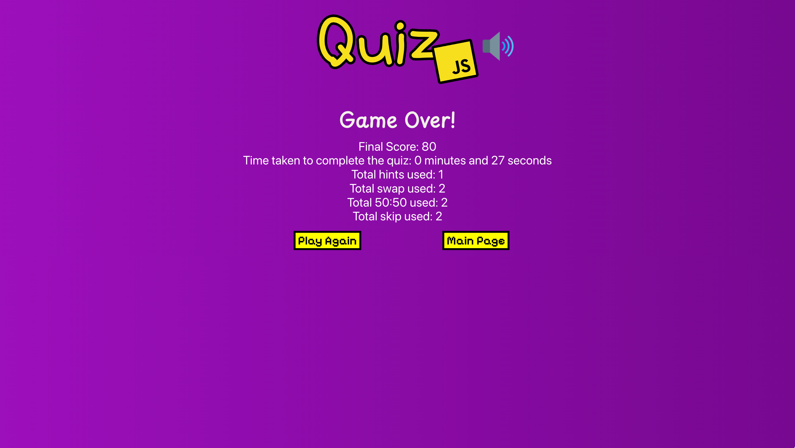
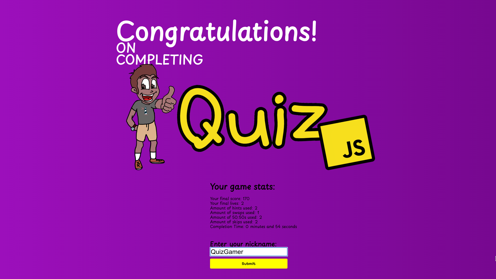

## Final Product

### Home Page

### Instruction Page

### Quiz Page

### Game Over Page

### Congrads Page

## Getting Started

1. Create database in PostgreSQL called quiz_app
2. Create the `.env` by using `.env.example` in the back-end folder
3. Update the .env file with your correct local information 
  - username: `labber` 
  - password: `labber` 
  - database: `quiz_app`
4. Install dependencies on both the front and back-end: `npm i`
5. Reset database: `node reset-database.js`
6. cd into back-end folder, Run the server: `npm run go`
7. cd into front-end folder, Run the client: `npm start`
8. Visit http://localhost:3000/

## Navigating the app

### Home page
- On the home page you see the top 24 high scores
- You can hit play to start the quiz or look at the Instructions page

### Instructions page
- On this page you learn how to play and how the point system works

### Quiz page
- This page is the game it's self
- Here you answer questions, earn points, and use hints if you stuck
- You score and game stats are being recorded as you go along
- you have a 5 min time limit to finish the quiz

### Congrads Page
- This is where you will see your score, final time and other game stats
- You enter in a nickname 
- if you scored high enough your score will be added to the leader board
- after submiting your nickname you will be sent back to the home page

## How to Reset the database

- Use the `node reset-database.js` command in the back-end each time there is a change to the database schema or seeds. 
  - It runs through each of the files, in order, and executes them against the database. 
  - Note: you will lose all newly created (test) data each time this is run, since the schema files will tend to `DROP` the tables and recreate them.

## Dependencies

- normalize.css 12.0.0
- animation.css 4.1.1
- axios: 0.18.1
- postcss-normalize 10.0.1
- react: 16.8.6
- react-dom: 16.8.6
- react-router-dom: 6.17.0
- react-scripts: 2.1.8
- sanitize.css 13.0.0
- body-parser: 1.20.2
- chalk: 4.1.2
- cors: 2.8.5
- dotenv: 16.3.1
- express: 4.18.2
- fs: 0.0.1-security
- knex: 3.0.1
- nodemon: 1.18.7
- pg: 8.11.3
- whatwg-fetch: 3.6.19

## Starting the server and the client

1. Run the server: `npm run go`
2. Run the client: `npm start`
3. Visit: http://localhost:3000/

## The team

- Nick Stilwell: https://github.com/nickstilwell52

- Yiyao Chen: https://github.com/ychento

- Hossein Safi: https://github.com/mhosseinsafi

- Ryan Stewart: https://github.com/ryanstew95
